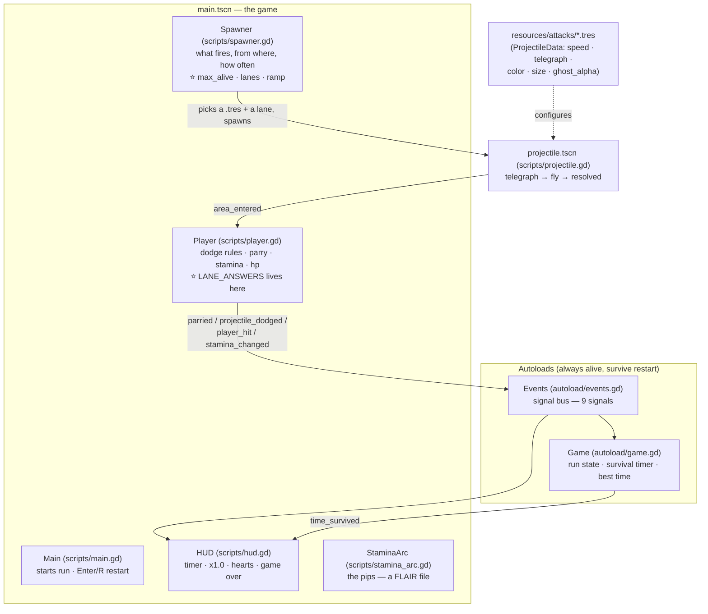

# The Map — where everything is

One page: what every file does, where every knob lives, and recipes for the edits you'll make yourself. Current as of the **v3 dodge rework** (timed + lane-matched dodging; the body nudge is cosmetic).

The Godot project is **`dodge-guy-gamejam/`** — that's what you open in Godot; `res://` means that folder.

## The big picture

**How a projectile dies, in order** (`player.gd → _resolve()`):
`parried` (J during `parry_window`, if `parryable`) → `dodged` (correct direction for its lane, while your dodge is active) → ignored (i-frames) → `hit` (−1 heart).

## The dodge rulebook (you can edit this)

`scripts/player.gd` → `const LANE_ANSWERS` — one table, plain text:

| Lane (where it comes from) | The dodge that beats it |
|---|---|
| `ABOVE` — falls down your column | `LEFT` or `RIGHT` (sidestep) |
| `LEFT` / `RIGHT` — body height | `UP` (jump) |
| `HEAD_LEFT` / `HEAD_RIGHT` — head height | `DOWN` (duck) |

Timing is the other half: your dodge is "active" for `dodge_out_time + dodge_hang_time + dodge_return_time` (~0.34s at defaults). Right direction + active window = the shot ghosts through you at `ghost_alpha` opacity (set it to `0` on the .tres and dodged shots vanish instead).

## Every file, one line each

| File | Owns | Your knobs there |
|---|---|---|
| `scripts/player.gd` | dodge/parry/stamina/hp rules, **LANE_ANSWERS** | all Dodge Feel / Parry / Stamina / Health / Input exports |
| `scripts/spawner.gd` | what spawns, when, from which lane | `max_alive`, `start_interval` → `min_interval` over `ramp_seconds`, `lanes` deck, `head_offset`, `spawn_radius` |
| `scripts/projectile.gd` | one shot's life: telegraph → fly → resolve | none (all per-attack knobs live on the .tres) |
| `scripts/projectile_data.gd` | the shape of an attack type | defines the .tres fields below |
| `resources/attacks/*.tres` | **your attack designs** | `speed`, `telegraph_time` (≥0.4!), `damage`, `parryable`, `color`, `size`, `ghost_alpha`, `deflect_speed_multiplier`, pulse look |
| `autoload/events.gd` | the signal bus | — (add signals here when systems need to talk) |
| `autoload/game.gd` | run state, timer=score, best time | — |
| `scripts/hud.gd` | timer/multiplier/hearts/game-over | — |
| `scripts/stamina_arc.gd` | the arc pips | `segments`, `radius`, `arc_degrees` — and `_draw()` is yours |
| `scripts/main.gd` | start + restart | — |
| `scenes/*.tscn` | node wiring | positions/sizes if you want to move the layout |

## Recipes for your manual edits

**1. One projectile type only**
Open `scenes/main.tscn` → click **Spawner** → Inspector → `Attacks` → set array size to 1 (or delete the chonker/spiker entries). Optionally delete `resources/attacks/chonker.tres` and `spiker.tres` in the FileSystem dock afterward. Nothing else references them.

**2. How many at once + speed**
- Concurrency: **Spawner → `max_alive`** (hard cap on threatening shots on screen; ghosted/parried ones don't count).
- Pace: **Spawner → `start_interval` / `min_interval` / `ramp_seconds`**.
- Speed: click `resources/attacks/zippy.tres` → `speed` (px/sec; 300 readable, 700 scary).

**3. Change what beats what** — edit `LANE_ANSWERS` in `player.gd` (e.g. add `Vector2.DOWN` to the `LEFT` lane's list to make body shots duckable too).

**4. Dodge feel** — Player → Dodge Feel: the nudge (`dodge_distance` — pure looks now), the window (`*_time`s), the snap (`*_trans`/`*_ease` dropdowns).

**5. Ghost look** — `.tres → ghost_alpha`: `0.25` faint pass-through, `0` instant vanish.

## FLAIR spots (empty hooks that are yours)

`player.gd`: `_on_dodge_start`, `_on_dodge_success` ⭐new, `_on_parry_start`, `_on_parry_success`, `_on_hit` · `stamina_arc.gd`: `_draw()` · `projectile.gd`: the telegraph pulse · `spawner.gd`: the ramp curve.
